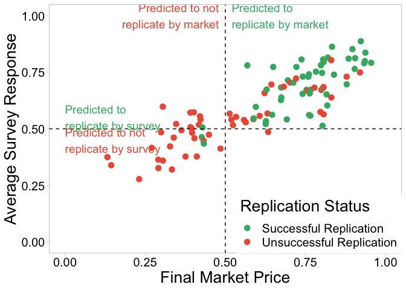
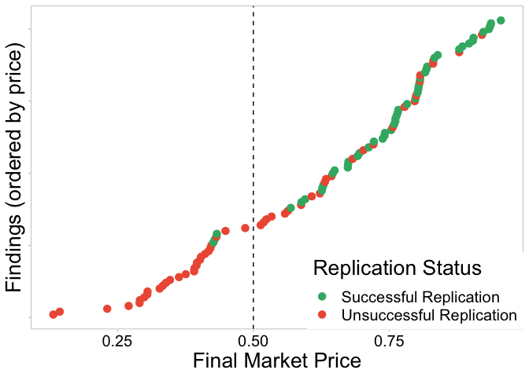
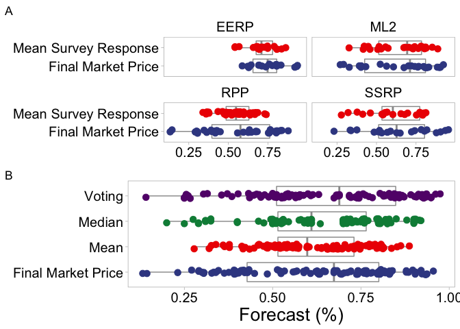

## pooledmaRket

`PooledMarketR` is an R package built to provide the Pooled Market
Dataset.

This dataset pools together the data from four similar prediction market
on the results of systematic replication studies.

The systematic replication studies are:

  - Replication Project: Psychology (Open Science Collaboration.
    Estimating the reproducibility of psychological science. Science
    2015)
  - Experimental Economics Replication Project (Camerer et
    al. Evaluating replicability of laboratory experiments in
    economics. Science 2016)
  - Social Sciences Replication Project (Camerer et al. \_Evaluating the
    Replicability of Social Science Experiments in Nature and
    Science.\_Nature Human Behaviour (2018))
  - Many Labs 2 (Klein et al. Many Labs 2: Investigating Variation in
    Replicability Across Samples and Settings. Advances in Methods and
    Practices in Psychological Science 2018)

And the accompanying prediction markets are:

  - RPP - Dreber et al 2015 (PNAS)
  - EERP - Camerer et al 2016 (Science)
  - SSRP - Camerer et al 2018 (Nat Human Behav)
  - ML2 - Forsell et al 2018

In the dataset the prediction markets are referred to as ‘projects’. I
would recommend reading the above studies before using the package. The
studies will explain the methodologies and provide context to the data.

### What this package contains

  - `finding_data`. This data set includes information about the
    original finding that was replicated, including study name and a
    binary variable where 0 indicates an unsuccessful replication and 1
    indicates successful replication.
  - `survey_data` . This includes individual responses to pre-market
    surveys. See studies for specific survey information, such as
    question wording.
  - `market_data`. This includes individual transactions for each study.
    Final market prices are taken as market beliefs. Note that user\_id
    in this data relates to the same user\_id in the survey data.

### How to use this package

The below example calculates the average survey belief and the final
market price for each of the 102 studies and the collates them into a
single table.

``` r
library(dplyr)
library(tidyr)
library(devtools)

install_github("michaelbgordon/pooledmaRket")

library(pooledmaRket)

aggregated_survey <- survey_data %>% group_by(project, finding_id) %>% summarise(average_survey_response = mean(response))

aggregated_market <- market_data %>% group_by(project, finding_id) %>% arrange(time_stamp) %>% 
    summarise(final_market_price = dplyr::last(price))


study_predictions <- finding_data %>% left_join(aggregated_survey) %>% left_join(aggregated_market)
```

The data can be used to assess and compare the characteristics of
various forecasting methods. Such as comparing survey with prediction
market results

``` r
library(ggplot2)
library(ggsci)

graph_data <- study_predictions %>% mutate(`Replication Status` = ifelse(replicated == 
    0, "Unsuccessful Replication", "Successful Replication")) %>% arrange(final_market_price) %>% 
    mutate(graph_order = c(1:103))


ggplot(graph_data) + geom_point(aes(x = final_market_price, y = average_survey_response, 
    colour = `Replication Status`), size = 3) + scale_color_manual(values = c("#3CB371", 
    "#EE5C42")) + labs(y = "Average Survey Response", x = "Final Market Price") + 
    theme_light() + geom_vline(xintercept = 0.5, linetype = "dashed") + geom_hline(yintercept = 0.5, 
    linetype = "dashed") + ggplot2::annotate("text", label = stringr::str_wrap("Predicted to replicate by survey", 
    20), x = 0, y = 0.55, size = 5, colour = "#3CB371", hjust = 0) + ggplot2::annotate("text", 
    label = stringr::str_wrap("Predicted to not replicate by survey", 20), x = 0, 
    y = 0.45, size = 5, colour = "#EE5C42", hjust = 0) + ggplot2::annotate("text", 
    label = stringr::str_wrap("Predicted to replicate by market", 20), x = 0.52, 
    y = 1, size = 5, colour = "#3CB371", hjust = 0) + ggplot2::annotate("text", label = stringr::str_wrap("Predicted to not replicate by market", 
    20), x = 0.48, y = 1, size = 5, colour = "#EE5C42", hjust = 1) + scale_x_continuous(limits = c(0, 
    1), breaks = c(0, 0.25, 0.5, 0.75, 1)) + scale_y_continuous(limits = c(0, 1), 
    breaks = c(0, 0.25, 0.5, 0.75, 1)) + theme(legend.justification = c(1, 0), legend.position = c(1, 
    0), panel.grid = element_blank(), axis.text = element_text(colour = "black", 
    size = 15), axis.title = element_text(colour = "black", size = 20), legend.title = element_text(colour = "black", 
    size = 20), legend.text = element_text(colour = "black", size = 15), )
```

<!-- -->

Comparing final market prices with
outcomes:

``` r
ggplot(graph_data) + geom_point(aes(x = final_market_price, y = graph_order, colour = `Replication Status`), 
    size = 3) + scale_color_manual(values = c("#3CB371", "#EE5C42")) + theme_light() + 
    geom_vline(xintercept = 0.5, linetype = "dashed") + labs(y = "Findings (ordered by price)", 
    x = "Final Market Price") + theme(legend.justification = c(1, 0), legend.position = c(1, 
    0), panel.grid = element_blank(), axis.text.y = element_blank(), axis.text = element_text(colour = "black", 
    size = 15), axis.title = element_text(colour = "black", size = 20), legend.title = element_text(colour = "black", 
    size = 20), legend.text = element_text(colour = "black", size = 15), )
```

<!-- -->

Compare the distributions of different survey aggregations and
prediction
market

``` r
graph_data <- graph_data %>% rename(`Final Market Price` = final_market_price, `Mean Survey Response` = average_survey_response) %>% 
    gather(`Final Market Price`, `Mean Survey Response`, key = measure, value = forecast)

other_aggregations <- survey_data %>% group_by(project, finding_id) %>% summarise(Mean = mean(response), 
    Median = median(response), Voting = mean(round(response, 0))) %>% left_join(aggregated_market) %>% 
    rename(`Final Market Price` = final_market_price) %>% gather(Mean, Median, Voting, 
    `Final Market Price`, key = measure, value = forecast)


figurepart1 <- ggplot(graph_data, aes(x = forecast, y = measure, colour = measure)) + 
    scale_color_aaas() + labs(y = NULL, x = "Forecast (%)") + theme_light() + theme(legend.position = "none", 
    strip.background = element_rect(fill = "white"), strip.text = element_text(colour = "black", 
        size = 15), plot.title = element_text(colour = "black", size = 20, hjust = 0), 
    panel.grid = element_blank(), axis.text = element_text(colour = "black", size = 15), 
    axis.title = element_text(colour = "black", size = 20)) + geom_boxplot(color = "gray60", 
    outlier.alpha = 0, orientation = "y") + geom_jitter(size = 3, alpha = 1, height = 0.1) + 
    facet_wrap(~project) + labs(y = NULL, x = NULL) + labs(tag = "A")


figurepart2 <- ggplot(other_aggregations, aes(x = forecast, y = measure, colour = measure)) + 
    scale_color_aaas() + labs(y = NULL, x = "Forecast (%)") + theme_light() + theme(legend.position = "none", 
    strip.background = element_rect(fill = "white"), strip.text = element_text(colour = "black", 
        size = 15), plot.title = element_text(colour = "black", size = 20, hjust = 0), 
    panel.grid = element_blank(), axis.text = element_text(colour = "black", size = 15), 
    axis.title = element_text(colour = "black", size = 20)) + geom_boxplot(color = "gray60", 
    outlier.alpha = 0, orientation = "y") + geom_jitter(size = 3, alpha = 1, height = 0.1) + 
    labs(tag = "B")


gridExtra::grid.arrange(figurepart1, figurepart2, nrow = 2)
```

<!-- -->
